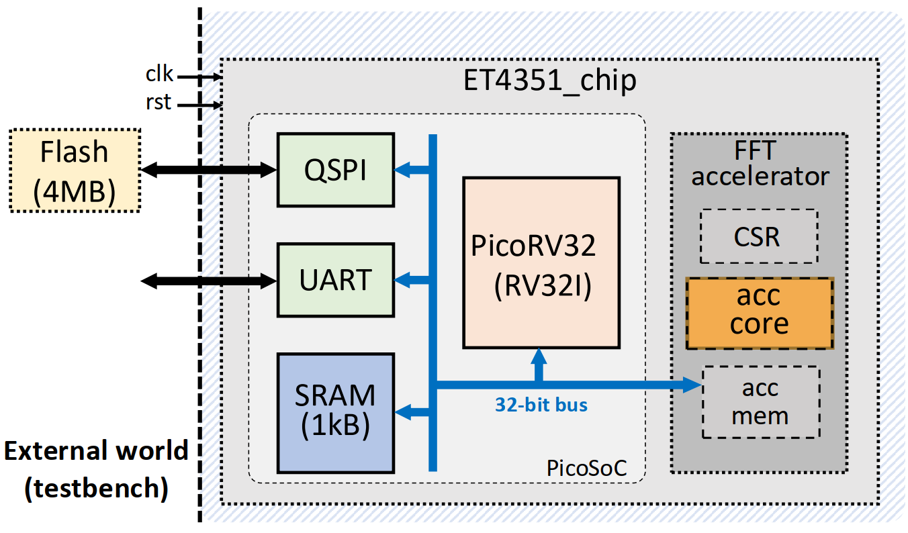
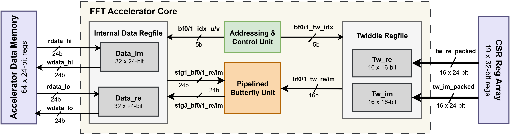
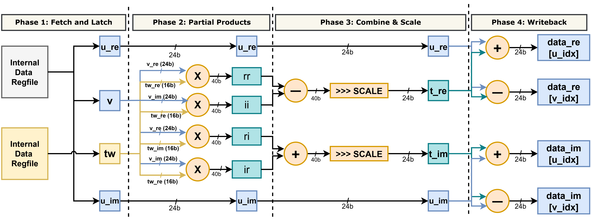
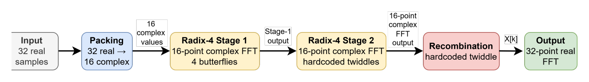
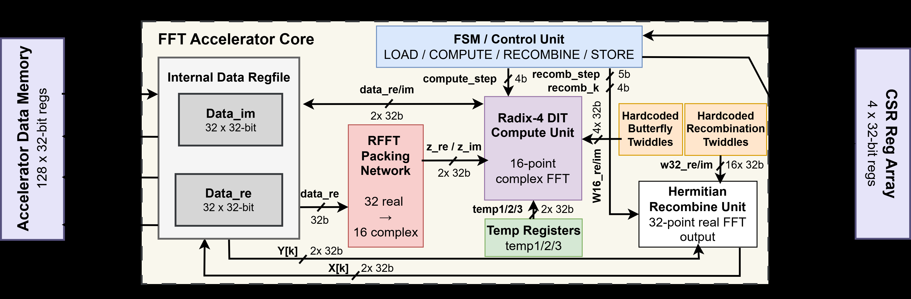

# ET4351 FFT Accelerator — Illustrated Showcase

> An illustrated tour of Group 9's two FFT accelerators for the `et4351` PicoRV32 SoC.
> All figures are taken from the [submitted report](<Group9/ET4351_Project_Report___Groupred (1).pdf>).

  
  
  
  
  
  

---

## 1 · The system

The accelerator is a peripheral on a PicoRV32 (RV32I) PicoSoC. The CPU, SRAM, QSPI flash,
UART, and the FFT accelerator all hang off a shared **32-bit `iomem` bus**. The accelerator
exposes a CSR block and its own data memory; the firmware streams samples in, kicks off the
transform, and reads results back — all over the same bus.

  

The task: a length-N = 32 complex FFT. The given **baseline** does it in 732 cycles at
12 MHz → **61.00 µs**, **0.403 mW**, **24.6 nJ**. Two designs improve on it from opposite
directions.

---

## 2 · High-Performance design — attack *latency*

**Idea:** the baseline spends ~88% of its cycles shuffling operands to/from memory. Replace
the single-port data memory with an **internal register file** (so every butterfly operand is
available in the same cycle), add a dedicated **twiddle register file** preloaded over CSRs,
and feed a **pipelined butterfly**. Then push the clock as high as timing allows.

  

The butterfly is a **4-phase pipeline** — *Fetch & Latch → Partial Products → Combine & Scale
→ Writeback* — so a new butterfly issues every cycle and the multipliers stay busy:

  

**Result:** 732 → **121 cycles**, clock raised to **66.2 MHz** (15.1 ns) →

| | Baseline | **HP** |
|---|---|---|
| Cycles / chunk | 732 | **121** |
| Clock | 12 MHz | **66.2 MHz** |
| Latency | 61.00 µs | **≈1.83 µs  (~33×)** |
| Energy | 24.6 nJ | 5.107 nJ (4.8×) |
| Setup / hold slack | — | +0.226 ns / +0.015 ns, **0 violations** |

---

## 3 · Energy-Efficient design — attack *energy*

**Idea:** keep the 12 MHz baseline clock (so power isn't inflated), but do far less work.
Because the input is purely real, pack the 32 real samples into 16 complex values and run a
**16-point FFT** — and since 16 = 4², that is exactly **two Radix-4 stages**, the first using
only trivial twiddles {1, −j, −1, +j} (no multipliers). A Hermitian **recombination** unit
reconstructs the 32-point real-FFT output. Finally, **manual clock gating** (TLATNCAX2 ICG
cells) switches the accelerator and its memory off when idle.

  

  

**Result:** energy **24.6 nJ → 2.59 nJ**, a **9.5×** reduction, at **0.239 mW** —

| | Baseline | **EE** |
|---|---|---|
| Clock | 12 MHz | 12 MHz |
| First-chunk latency | 61.00 µs | 10.83 µs |
| Total power | 0.403 mW | **0.239 mW** |
| Energy | 24.6 nJ | **2.59 nJ  (9.5×)** |
| Setup / hold slack | — | +35.299 ns / +0.056 ns, **0 violations** |

---

## 4 · Both designs are signed off

Both designs are taken through full Innovus place-and-route and signoff on `gpdk045`,
within the 596.4 µm × 596.4 µm core budget:

| Check | HP | EE |
|---|---|---|
| Setup violations | **0** | **0** |
| Hold violations | **0** | **0** |
| SI glitches | **0** | 2 (within risk budget) |
| DRV / connectivity / antenna | clean | clean |
| VCD activity annotation | 100 % | 100 % |
| Cell area (`et4351`) | 251,294 µm² | 268,311 µm² |

Raw signoff reports live under `Group9/finaldesign_hp/Reports/` and
`Group9/finaldesign_ee/reports/finalReports/`. The full write-up (design reasoning,
per-member contributions, appendix power excerpts) is in the
[6-page IEEE report](<Group9/ET4351_Project_Report___Groupred (1).pdf>).
