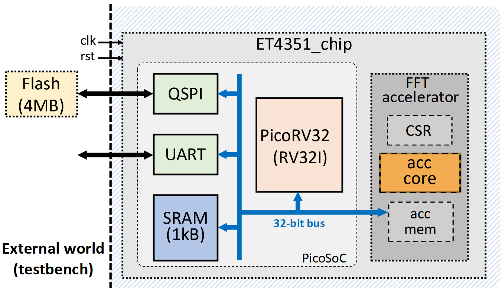
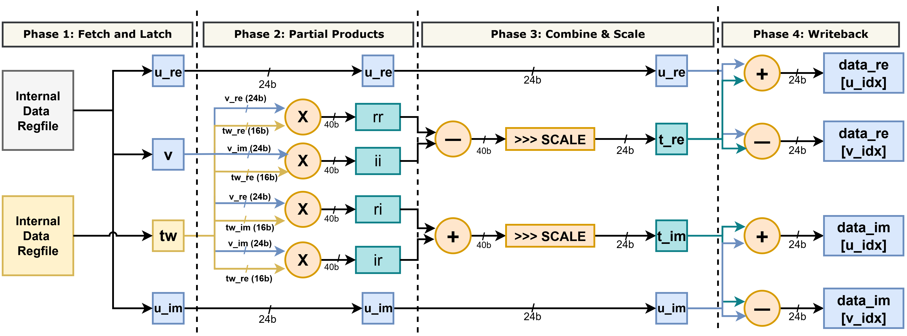

# ET4351 Digital VLSI Design — FFT Accelerator

**TU Delft — ET4351 Digital VLSI Design, 2026 Project**

A high-performance 32-point FFT hardware accelerator integrated into a PicoRV32 RISC-V SoC, targeting the SAED32 45nm technology library. The design combines six architectural optimisations to achieve a **~33× end-to-end latency reduction** over the baseline — from 61 µs down to ~1.83 µs per audio chunk.

For the general project structure, SoC architecture, design flow, and tooling, refer to the [README on the `baseline` branch](../../tree/baseline).

---

## Summary of Optimisations

| # | Optimisation | Effect |
|---|---|---|
| 1 | **Register-file datapath** | All 32 complex samples held in flip-flops. Eliminates per-butterfly accelerator memory reads/writes during compute — accelerator memory is accessed only during bulk LOAD and STORE phases. |
| 2 | **SW twiddle preload via CSR** | Firmware pre-computes 16 twiddle pairs (W^k\_32, k=0..15) and writes them to CSR registers before asserting enable. Removes all twiddle accesses from the timed window and reduces accelerator memory from 128→64 words. |
| 3 | **2× parallel butterfly units** | Two independent butterfly datapaths process two operations per cycle, halving the issue count per FFT stage from 16 to 8 cycles. |
| 4 | **4-stage micro-pipeline** | The butterfly datapath is split into FETCH → MUL1 → MUL2 → ADD stages. A new butterfly pair enters every clock cycle (1-throughput). Each FFT stage completes in 8 fetch + 3 drain = **11 cycles**. The pipeline also breaks the long combinational multiply-add chain, enabling much higher clock frequencies. |
| 5 | **Wide paired memory port** | A 48-bit paired memory interface reads/writes one complete complex sample (re + im) per cycle during LOAD and STORE phases, **halving the memory transfer time** from 128 to 64 cycles. |
| 6 | **24-bit datapath narrowing** | Internal data width narrowed from 32 to 24 bits. Reduces register-file, memory, and multiplier area (24×16 instead of 32×16 per multiply). 24-bit range (±8M) is more than sufficient for the audio FFT signal path. |

Twiddle factors are stored as **16-bit Q12** values and packed into CSR registers — each 32-bit CSR word holds one complete twiddle pair `{tw_im[15:0], tw_re[15:0]}`, halving the CSR count from 32 to 16 (total CSR registers: 35→19).

---

## Comparison with Baseline

| Metric | Baseline | This Design |
|---|---|---|
| FSM states | 13 (per-element memory R/W) | 5 (`INIT → LOAD → COMPUTE → STORE → FINISH`) |
| Compute architecture | Single butterfly, fully combinational, all via accelerator memory | 2× parallel, 4-stage pipelined, 24-bit register-file |
| Twiddle source | Read from accelerator memory (inside timed window) | Packed CSR registers (firmware preload before enable) |
| Memory interface | 32-bit single-port (1 word/cycle) | 32-bit narrow (CPU) + 48-bit wide paired (FFT) |
| Internal data width | 32-bit | 24-bit (sign-extended at bus boundaries) |
| Accelerator memory depth | 128 words (data + twiddles) | 64 words (24-bit data only) |
| CSR registers | N/A | 19 (3 config + 16 packed twiddle) |
| Cycles per chunk (N=32) | 732 | **121** |
| PnR-verified frequency | ~12 MHz | **66.2 MHz** (post-route timing clean) |
| Latency per chunk | ~61 µs | **~1.83 µs** |

The ~33× speedup comes from two independent and multiplicative axes: 6× fewer cycles **and** 5.5× higher clock frequency.

---

## Architecture

### Micro-Pipeline

The compute engine is a **4-stage pipeline** with 2× parallel butterfly lanes:

A 3-bit shift register (`pipe_vld`) tracks valid data in flight. The pipeline pumps a new butterfly pair every cycle while `bf_cnt < N/2`. After the last fetch, 3 drain cycles flush the pipeline. Stage advancement is triggered on the **last drain cycle** — the same posedge where the final ADD/writeback completes — eliminating dead bubbles between FFT stages.

Per-stage cycle count for N=32: **8 fetch + 3 drain = 11 cycles**. Across 5 stages: **55 compute cycles**.

### Wide Paired Memory Port

The accelerator memory exposes two independent interfaces:

- **Narrow port** (32-bit, byte-enable): serves CPU reads/writes via the PicoRV32 `iomem` bus.
- **Wide port** (64-bit, pair-addressed): serves the FFT core during LOAD and STORE phases, reading/writing one complex pair (re + im) per cycle.

The two ports are mutually exclusive by protocol — the CPU writes data before asserting `enable_accel`; the FFT core operates after. No arbitration logic is needed. The design exploits the interleaved `[re[0], im[0], re[1], im[1], ...]` memory layout: a 5-bit `pair_addr` selects one of 32 complex pairs, producing two 32-bit words via **32:1 mux trees** instead of two independent 64:1 trees.

This also **simplifies the wrapper**: the old shared CPU↔FFT address/data mux is eliminated entirely, with each path connecting directly to its respective memory port.

### Cycle Breakdown (N=32)

| Phase | Cycles | % of Total |
|---|---|---|
| INIT | 1 | 0.8% |
| LOAD_DATA | 32 | 26.4% |
| COMPUTE | 55 | 45.5% |
| STORE_DATA | 32 | 26.4% |
| FINISH | 1 | 0.8% |
| **Total** | **121** | **100%** |

For the first time, COMPUTE (45.5%) is the **dominant phase**, overtaking LOAD+STORE (52.9%). In the baseline, memory transfers accounted for ~88% of total cycles. Further cycle reduction now requires either wider memory (W=4) or more butterfly parallelism (P=4).

---

## Place-and-Route Results (Innovus, SAED32 45nm)

**Target:** 66.2 MHz (15.1 ns) &ensp;|&ensp; **Corner:** fast\_vdd1v2 (power), PVT\_0P9V\_125C (timing) &ensp;|&ensp; **Clock uncertainty:** 150 ps

### Area

| Module | Cell Count | Total Area (µm²) |
|---|---|---|
| **et4351 (top)** | 65,307 | **251,294** |
| accelerator | 41,976 | 140,132 |
| &emsp;fft | 27,227 | 91,371 |
| &emsp;mem (64-deep) | 9,137 | 31,334 |
| picosoc | 23,265 | 110,752 |

Total SoC area is **251,294 µm²**, well within the 596.4 × 596.4 µm = **355,693 µm² core budget** (70.66% utilisation).

### Timing

| Check | WNS (ns) | TNS (ns) | Violating Paths |
|---|---|---|---|
| **Setup** | +0.226 | 0.000 | 0 |
| **Hold** | +0.015 | 0.000 | 0 |

Setup and hold timing are both clean across all 12,049 paths with no violations. Reg2reg worst setup slack is **+2,625 ps**, confirming the critical path remains in the **SPI flash → PicoRV32 interface**, not the accelerator.

### DRV Summary

10 max-transition violations remain on real nets (worst −0.223 ns) — predominantly on flash I/O pads where transition times are dominated by external board-level loads. No max-capacitance, max-fanout, or max-length violations. **0 SI glitch violations** (resolved via SI-aware delay calculation and post-route wire spreading).

---

## Modified Memory Map

| Address | Register | Description |
|---|---|---|
| `0x0300_0000` | `iomem_accel[0]` | Config & Status (reset / enable / done) |
| `0x0300_0004` | `iomem_accel[1]` | Number of entries (N) |
| `0x0300_0008` | `iomem_accel[2]` | Number of FFT stages (log₂ N) |
| `0x0300_000C – 0x0300_0048` | `iomem_accel[3..18]` | 16 packed twiddle CSRs: `{tw_im[k][15:0], tw_re[k][15:0]}`, k=0..15 |
| `0x0300_004C+` | `MEM[0..63]` | Accelerator data memory region (64 × 24-bit words, re/im interleaved) |

Each twiddle CSR packs both the real and imaginary parts of one twiddle factor into a single 32-bit word (lower 16 bits = tw\_re, upper 16 bits = tw\_im). The wrapper unpacks and sign-extends these to 24-bit (`DATA_WIDTH`) flat buses (`tw_re_packed`, `tw_im_packed`) via a generate block, giving the FFT core combinational access to any twiddle by index.

---

## Key Design Files

| File | Role |
|---|---|
| `src/design/accelerator_fft.v` | FFT core: 24-bit register-file, 2× parallel, 4-stage pipeline, wide memory interface |
| `src/design/accelerator.v` | Wrapper: 19-register CSR array, packed twiddle unpacking/sign-extension, dual-port memory routing |
| `src/design/accelerator_mem.v` | Dual-interface register-based memory: 32-bit narrow (CPU) + 64-bit wide paired (FFT), 24-bit internal storage with sign extension |
| `firmware/accel_audio.c` | Firmware: packed twiddle CSR preload (`{tw_im, tw_re}`), data orchestration |
| `firmware/fft.py` | Python golden-reference FFT with global twiddle table |
| `src/sdc/et4351.sdc` | Timing constraints (66.2 MHz target, 150 ps clock uncertainty) |

---

## Design Notes

- **Two independent speedup axes.** Cycle count reduction (732→121) and clock frequency increase (~12→66.2 MHz) are orthogonal improvements that multiply together for the ~33× overall latency reduction. The HP target has no clock frequency constraint — any valid combination works.
- **Memory bandwidth was the binding constraint.** In the baseline, accelerator memory reads/writes consumed ~88% of cycles. The wide paired memory port halves the transfer time, while the register-file architecture confines accelerator memory access to bulk LOAD/STORE phases.
- **Zero-bubble stage transitions.** The pipeline advance condition (`pipe_last_drain`) fires on the same posedge as the last ADD/writeback. This eliminates the dead cycle that would otherwise occur between consecutive FFT stages, saving 5 cycles total (1 per stage).
- **24-bit datapath.** The internal data width is narrowed from 32 to 24 bits, reducing register-file storage (64 × 24 vs 64 × 32), memory cell area, and multiplier size (24×16 instead of 32×16). Sign extension to/from the 32-bit bus interface is handled at the memory and store-phase boundaries. The 24-bit signed range (±8,388,607) is sufficient for the audio FFT signal path.
- **Packed twiddle CSRs.** Each twiddle pair (tw\_re + tw\_im, both 16-bit Q12) is packed into a single 32-bit CSR word by firmware, halving the CSR count from 32 to 16. The wrapper unpacks and sign-extends to 24-bit for the FFT core.
- **PnR-verified frequency.** The 66.2 MHz target (5.5× baseline) closes timing post-route with +226 ps setup slack and +15 ps hold slack — fully clean. Clock uncertainty is tightened to 150 ps.
- **Drop-in compatible interface.** The firmware (`accel_audio.c`) handles twiddle packing and the updated memory map transparently. Verification scripts work without modification.

---

## Authors & Acknowledgments

Course staff and contributors across multiple years:

- **May 2023**: Chang Gao, Charlotte Frenkel — Original baseline (counter accelerator)
- **April 2024**: Nicolas Chauvaux, Douwe den Blanken — Sorting accelerator + memory interface
- **Jan 2025**: Ang Li, Yizhuo Wu — Pathfinding accelerator
- **Jan 2026**: Nicolas Chauvaux, Douwe den Blanken, Guilherme Guedes — FFT accelerator baseline

PicoRV32 and PicoSoC by Claire Xenia Wolf ([YosysHQ/picorv32](https://github.com/YosysHQ/picorv32)).

HP accelerator optimisations (register-file, twiddle preload, parallel butterflies, micro-pipeline, wide memory port, 24-bit datapath narrowing) by the HP RTL architecture team.

---

## License

This project is provided for educational use within the TU Delft ET4351 course. The PicoRV32/PicoSoC components are distributed under the ISC license (see source headers).